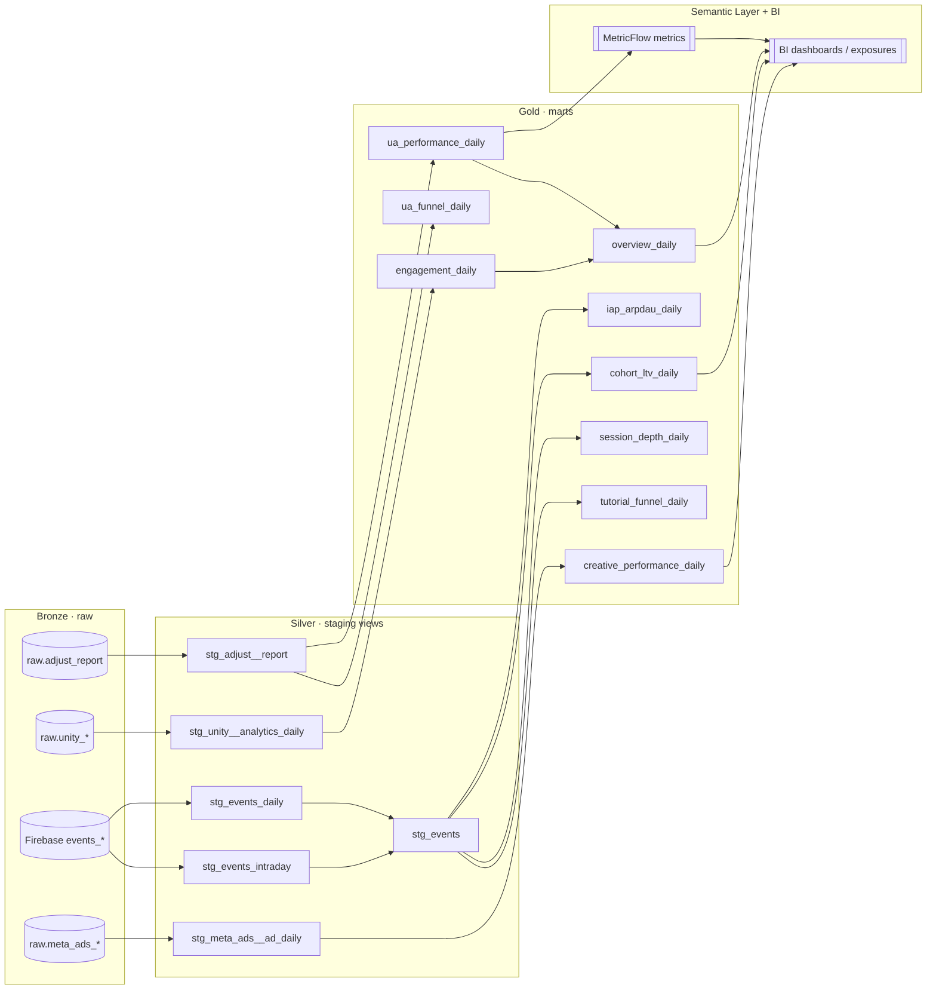
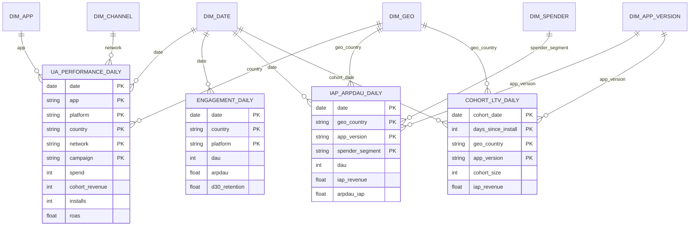

# Architecture & Data Modeling

## 1. Modeling approach

- **Medallion layering** (Bronze → Silver → Gold) for clear, testable
  separation of concerns.
- **Dimensional (Kimball) marts** at the Gold layer: each mart is a **fact** at
  a documented daily grain, described by a small set of **conformed
  dimensions** (`date`, `app`, `platform`, `country/geo`, `network/campaign`,
  `app_version`, `spender_segment`). Conformed dimensions are what let analysts
  slice ROAS, ARPDAU and LTV the same way across every mart.
- **Long (tidy) facts** over wide pivots where a dimension would otherwise
  explode into columns (e.g. `spender_segment`, `step_num`, `days_since_install`
  are rows, not columns) — so new checkpoints/segments need no schema change.

## 2. Layer responsibilities

| Layer | Schema | Materialization | Rules |
|---|---|---|---|
| Bronze (raw) | `raw`, GA4 export | source | No transformation. Declared in `src_*.yml` with freshness SLAs. |
| Silver (staging) | `staging` | **view** | One model per source object. Type-cast, snake_case, flatten structs, hash PII, light dedup. No business logic, no joins across sources. |
| Gold (marts) | `marts` | **incremental table** | Business facts at a stated grain. Tested for grain-uniqueness + ranges. The only layer BI should touch. |
| Analytics | `analytics` | view | Deeper player-behaviour exploration; reuses `stg_events`. |

**Why these materializations:** staging views are free and always fresh; marts
are incremental tables (`insert_overwrite`, partitioned by date) because they
back dashboards and Adjust/Firebase data mutates retroactively — a 14–44 day
rebuild window absorbs late-arriving data idempotently.

## 3. Source → mart lineage (DAG)

## 4. Conformed-dimension ERD (Gold layer)

A star-schema view of the marts: fact tables (daily grain) surrounded by the
conformed dimensions that join/slice them.

## 5. Source-of-truth precedence

Three systems measure overlapping things at different scopes — by design they
do **not** reconcile, and dashboards label them distinctly:

| Question | Source of truth | Mart |
|---|---|---|
| How did *this UA campaign* perform? | **Adjust** | `ua_performance_daily`, `ua_funnel_daily` |
| How is *the whole game* doing? | **Unity Analytics** | `engagement_daily` |
| How is *this creative* performing? | **Meta Ads** | `creative_performance_daily` |
| In-game behaviour, cohorts, LTV | **Firebase events** | `iap_arpdau_daily`, `cohort_ltv_daily`, session/tutorial marts |

## 6. Extensibility

- New metric from an existing source → add a column to the staging view, then
  the mart. `on_schema_change='append_new_columns'` evolves marts cleanly.
- New source → add `raw` table + `src_*.yml`, a `stg_<src>__*` view, then fold
  into an existing mart (preferred) or a new one.
- New LTV checkpoint (D45/D60) → bump `max_dsi` and `--full-refresh`; no schema
  change (long format).
